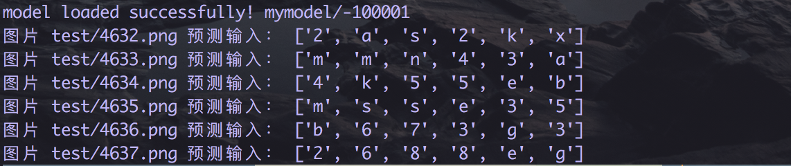
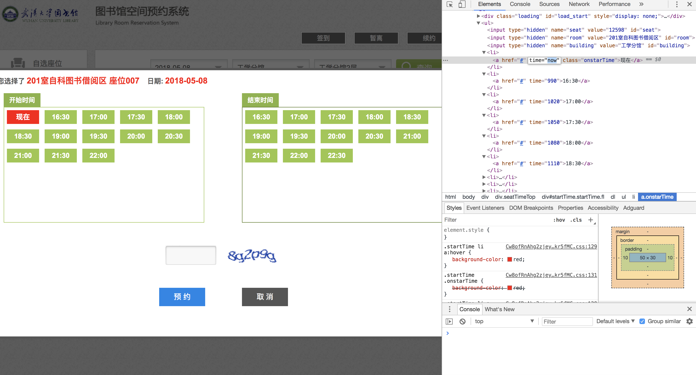
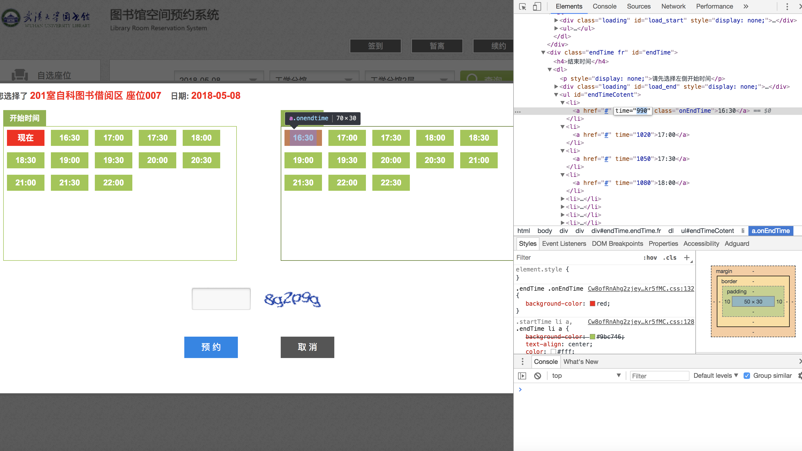
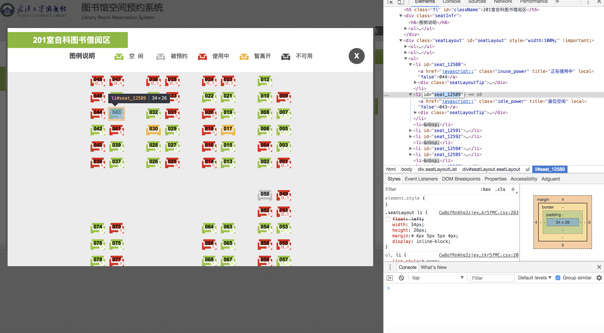

# 破解武汉大学图书馆系统验证码
自动识别验证码登录武汉大学图书馆系统

只使用cnn准确率达到了84%

测试图片

测试结果

开始时间，结束时间ID的提取

座位号ID的提取

每一个座位的ID号、开始时间、结束时间以及当前日期其实都可以爬下来

不过我懒得弄了，毕竟都大三了，也用不着图书馆了，有兴趣的同学可以继续(つД｀)･ﾟ･

关于准确率84%，我猜测是数据集大小的问题，有时间弄多点数据再训练一次(ಥ_ಥ)

嗯，就酱！
